

  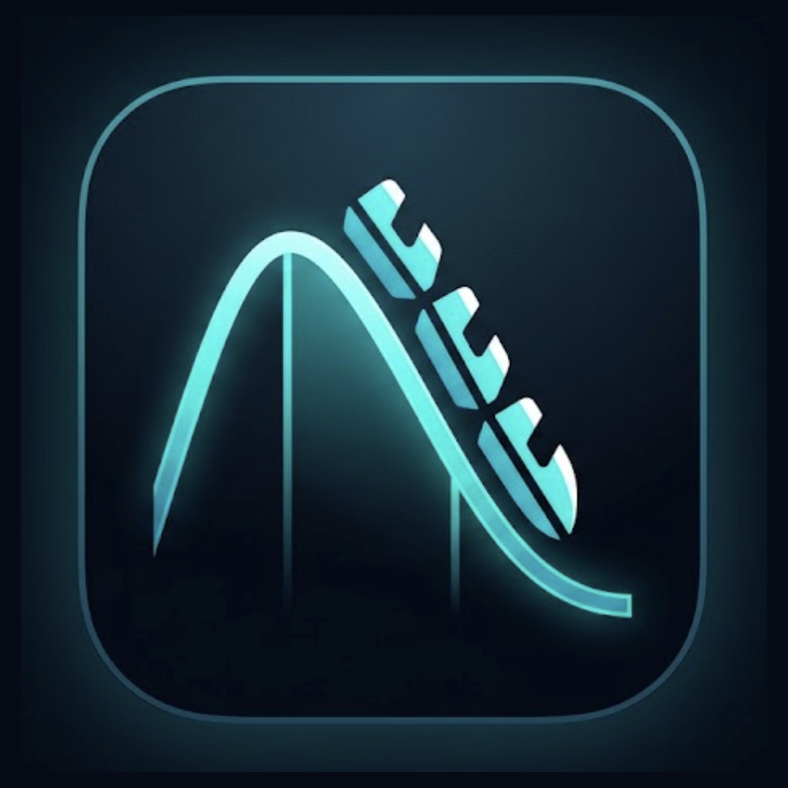

<h1 align="center">RideStats</h1>

  <strong>A personal ride logger for Android</strong> 
  Record forces · review your rides · keep everything on your phone

  
  
  
  

  <a href="https://github.com/MRJOHN5ON/RideStats/releases/tag/v1.1.2"><strong>Download v1.1.2</strong></a>
  &nbsp;·&nbsp;
  <a href="https://github.com/MRJOHN5ON/RideStats/releases">All releases</a>

---

## What it is

RideStats lets you **log roller coaster rides from your phone** — record a session, see your G-forces and ride timeline, save your history, and share a ride card when you want.

Everything stays **on your device**. No account, no cloud, no tracking.

The app ships with the **Six Flags Magic Mountain** coaster catalog. RideStats is an **independent fan app** and is not affiliated with any theme park.

---

## Download

RideStats is not on the Play Store. Sideload the latest APK from GitHub Releases.

**[Download RideStats 1.1.2](https://github.com/MRJOHN5ON/RideStats/releases/tag/v1.1.2)** — file: `RideStats-1.1.2.apk`

Need an older build? See **[all releases](https://github.com/MRJOHN5ON/RideStats/releases)**.

**Install steps**

1. Download **`RideStats-1.1.2.apk`** from the link above
2. Open the file → **Install** (if blocked, allow installs from your browser or Files app in Android settings)
3. Before your first ride: **Settings → Pocket Recording Setup** — allow notifications and unrestricted battery

  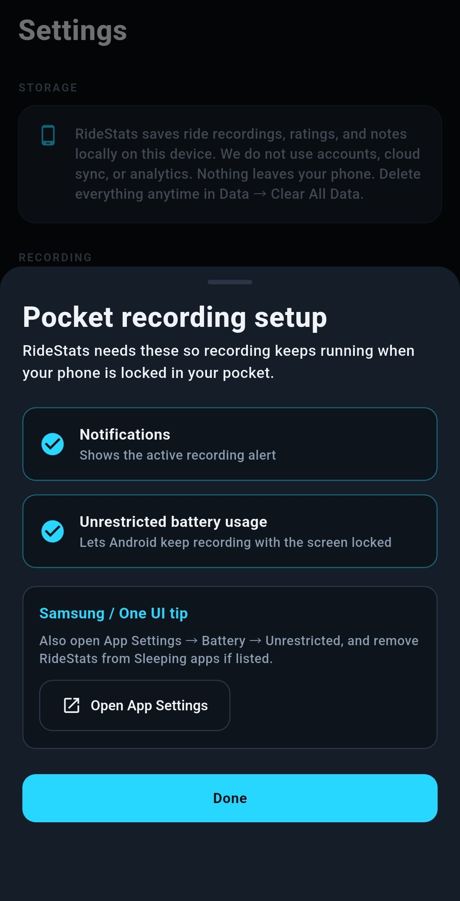

On Samsung: **Settings → Security and privacy → Install unknown apps** for Chrome or My Files, and set RideStats battery to **Unrestricted**.

Demo build — no warranty. G-force and speed readings are phone-sensor estimates, not official park data. Use at your own risk.

---

## What’s new in v1.1.2

- Force timeline toggle uses plain labels — **Up/down**, **Sides**, **Fwd/back** instead of Vert/Lat/Long
- Short description under the toggle explains what each view shows
- Peak badges read naturally — e.g. **Heaviest 4.2G**, **Strongest sway ±2.1G**
- Report stats renamed for clarity — **Lightest moment**, **Side sway peak**

> **Upgrading from 1.1.1?** No data reset — install over your existing app. Older release notes are on **[all releases](https://github.com/MRJOHN5ON/RideStats/releases)**.

---

## Browse coasters

Pick a ride from the catalog, check the stats, and hit record.

  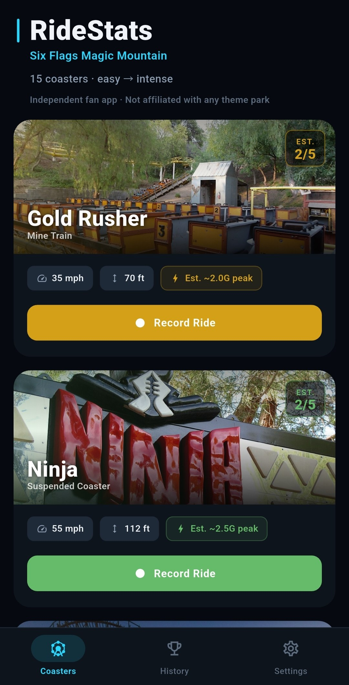
  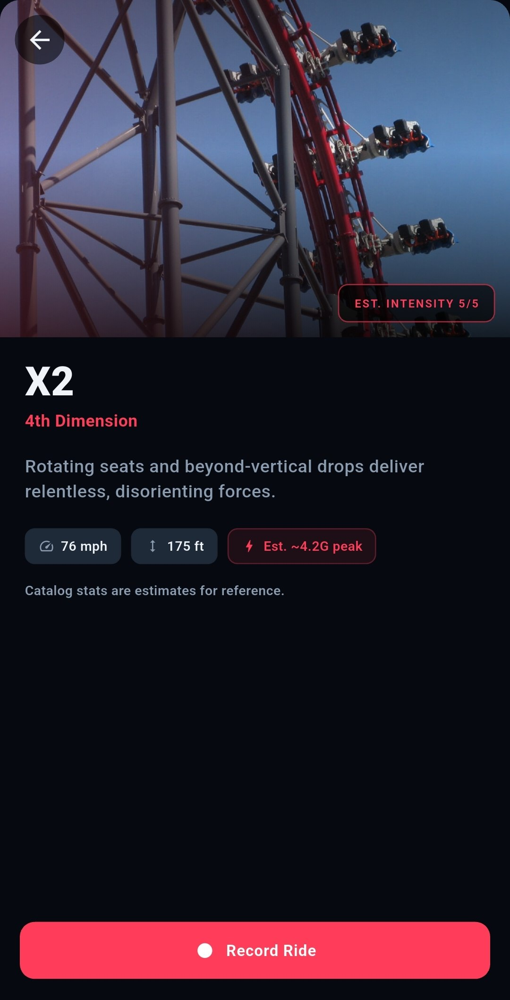

---

## Record in your pocket

Start a session, lock your phone, and ride. RideStats keeps logging in the background.

  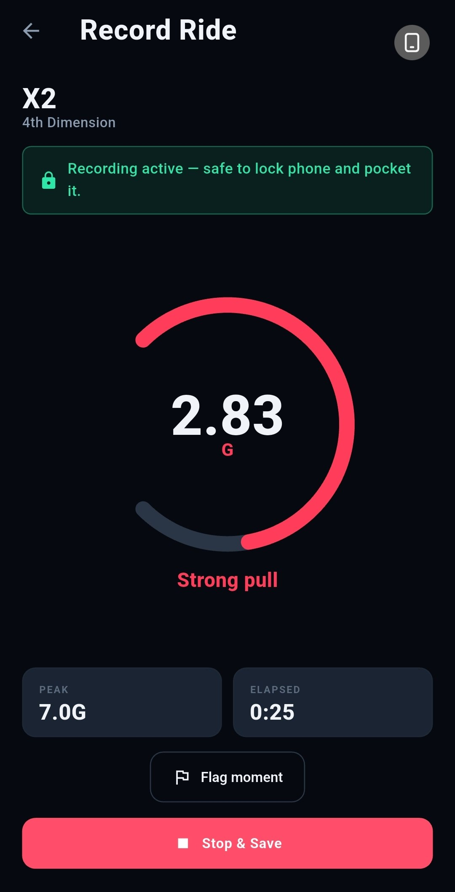

---

## Ride report

After a ride you get peak G, stats, a force timeline, optional rating and notes, and a comparison against catalog reference estimates. Toggle **Up/down**, **Sides**, or **Fwd/back** on the timeline to see different forces on the ride.

  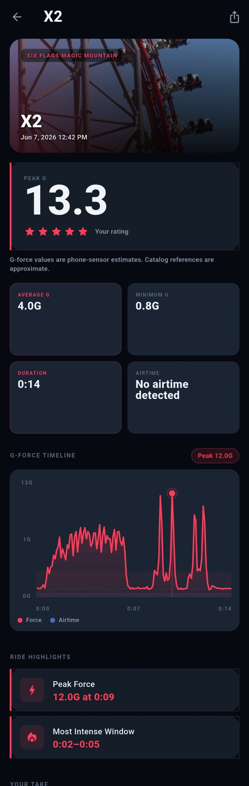
  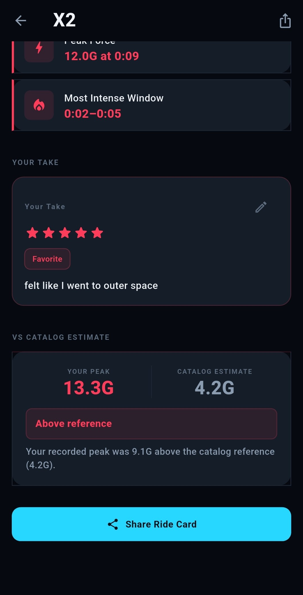

---

## History

Sessions are grouped by coaster. Personal records track your best peaks, airtime, ratings, and longest rides.

  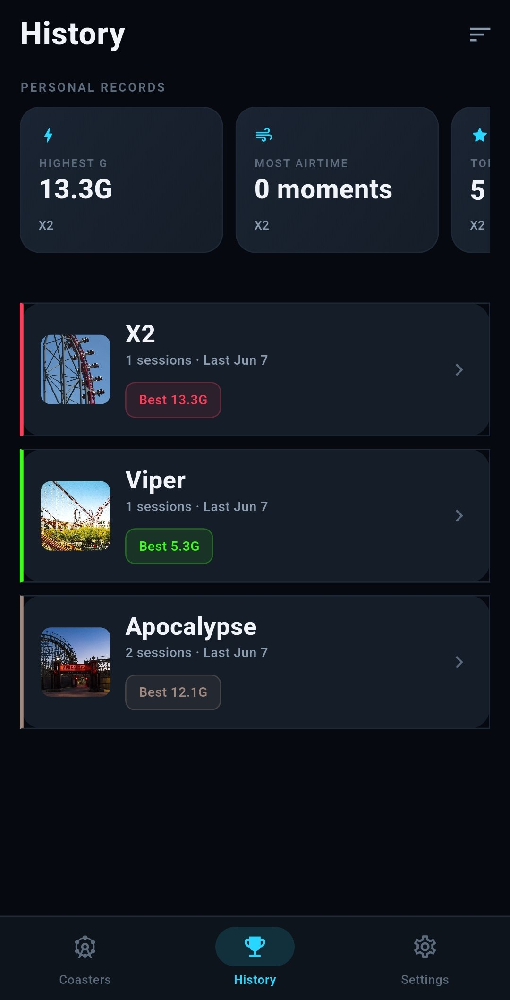

---

## Share a ride card

Export a **Performance** or **Reaction** card as an image and send it through your phone’s share menu.

  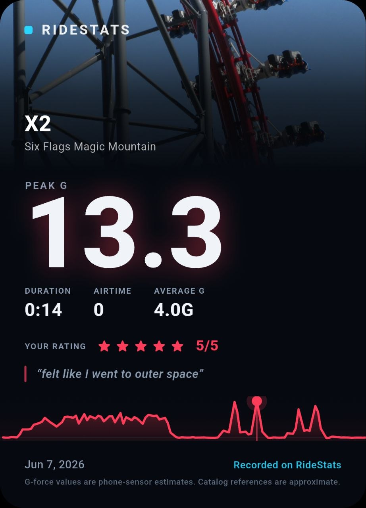
  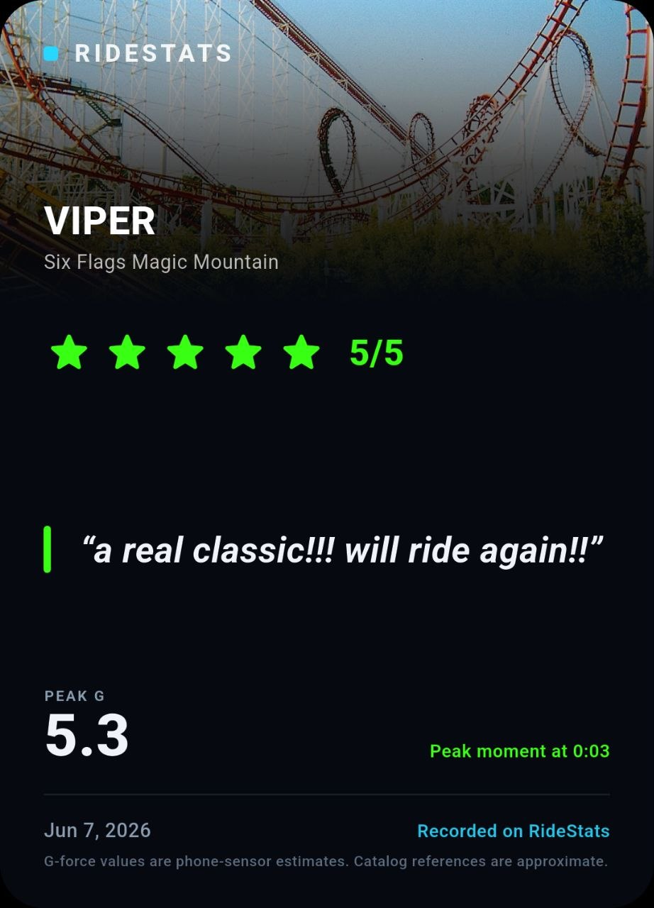

---

## Privacy

Your rides, ratings, and notes stay **on your phone**. RideStats does not upload your data or run a backend. Sharing only happens when you choose to. Clear everything anytime in Settings.

  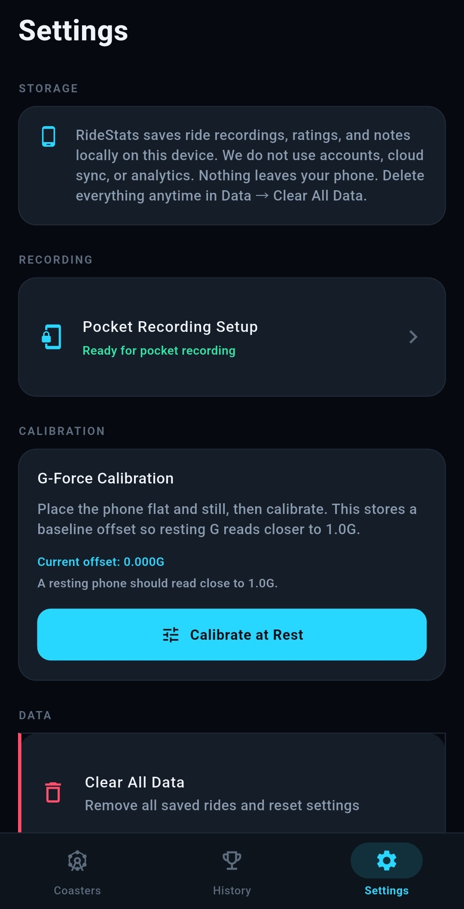

---

## About

I’m a **manual QA person**, not a software engineer. I vibecoded RideStats in about **half a day** with **AI-assisted development** (Cursor) — product direction, UI, copy, and testing on a real Android device.

Full Flutter app: recording, local storage, reports, history, share cards. Source is private; this page and the APKs are the public showcase.

---

  Independent fan app · Not affiliated with Six Flags or any theme park

